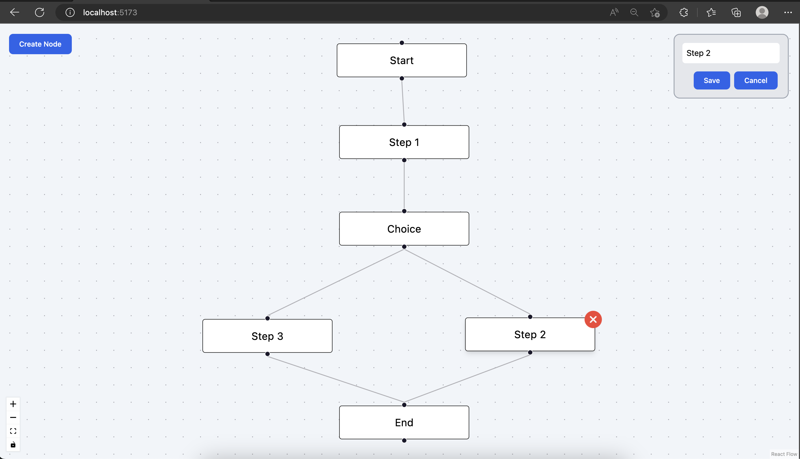

# ReactFlow Renderer

Developed a web app using React Flow library which provides CUD (Create, Update, Delete) operations for building node-based editors and interactive diagrams

Watch the YouTube Demo here: https://youtu.be/0c9ljLWw4s0



## Features 🌟

- Create node
- Delete Node
- Edit Node Name
- Delete Edge
- Connect Nodes via Edges

## Technologies Used 💻

- **React.js**: For building the user interface.
- **React Flow**: Library for building node based interactive diagrams.
- **Redux**: For state management.
- **Tailwind CSS**: For styling the application.
- **Vite**: As a web application bundler.

## Getting Started 🚀

These instructions will get you a copy of the project up and running on your local machine for development and testing purposes.

### Prerequisites

- Node.js
- npm

### Installation

1. Clone the repo and go to cloned directory
   ```sh
   git clone https://github.com/heymitali/react-flow.git; cd react-flow
   ```
2. Install NPM packages

   ```sh
   npm install
   ```

3. Build and Start the server

   ```sh
   npm run dev
   ```

4. Open your browser and navigate to http://localhost:5173
